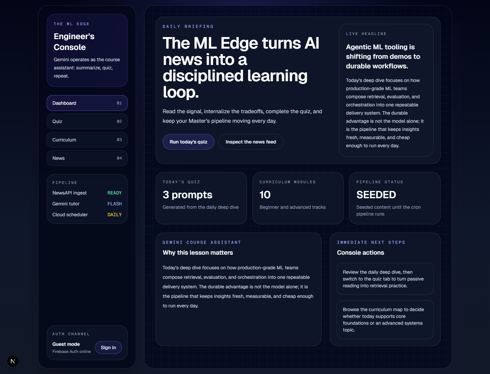
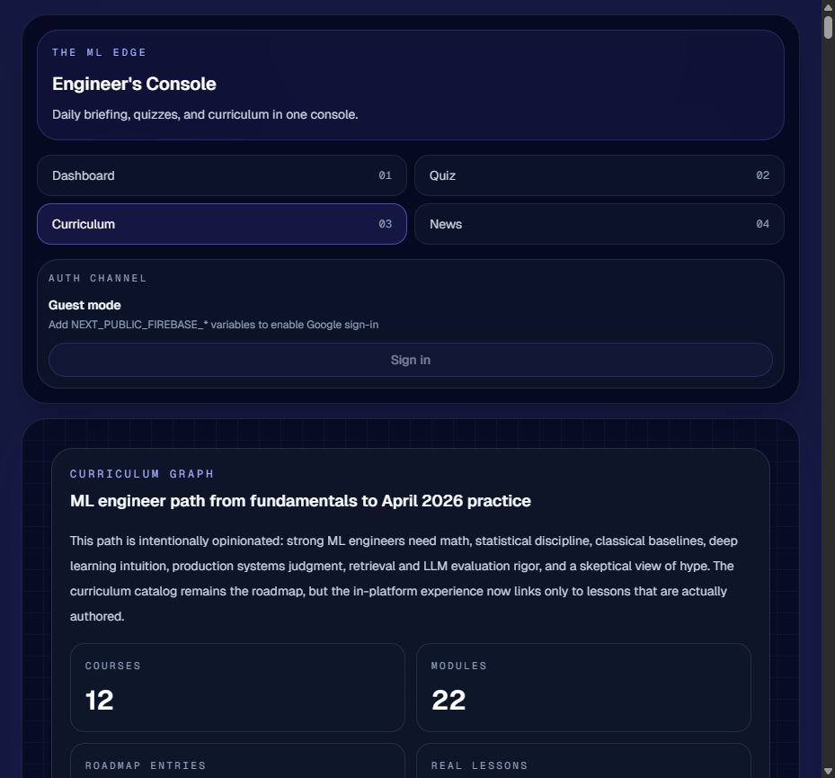
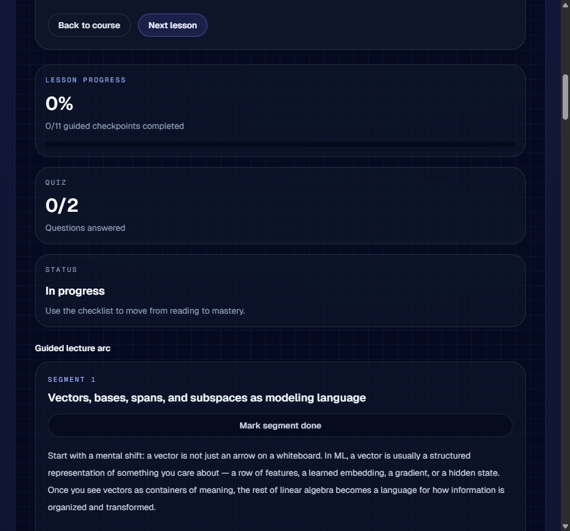
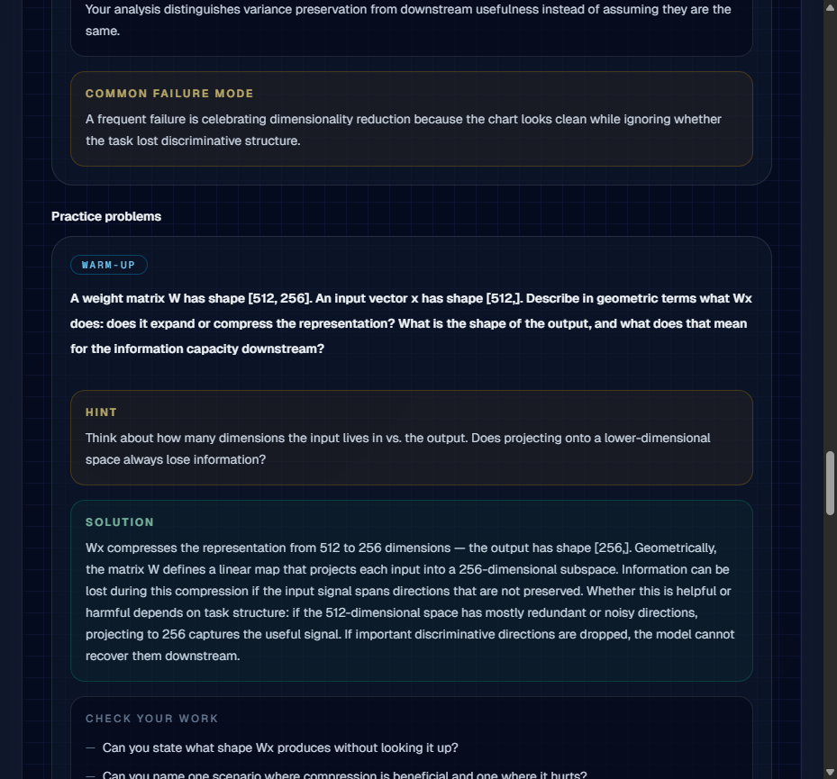
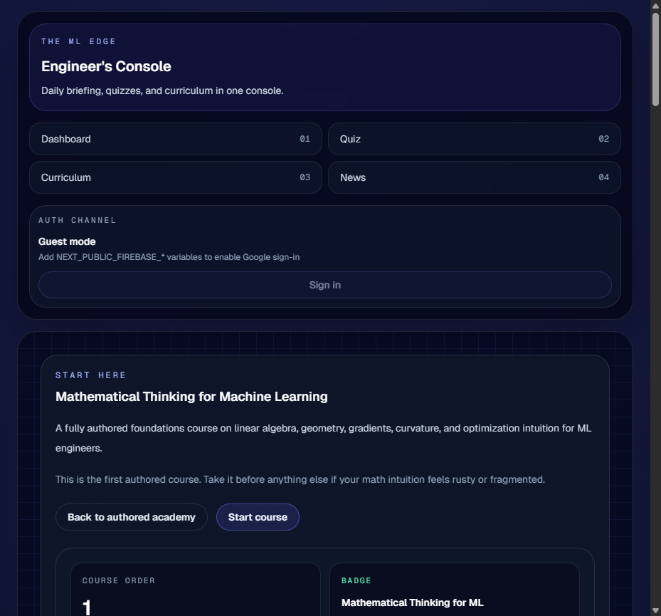
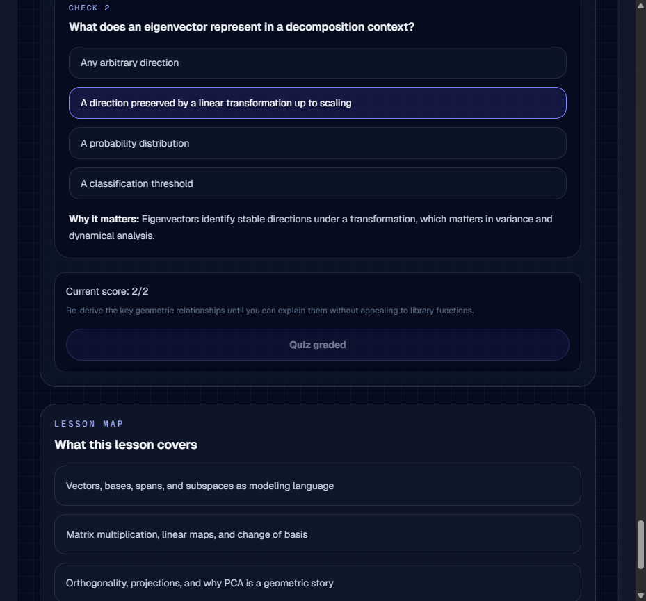

# The ML Edge

A self-directed ML/data science learning platform built for depth over breadth — dark-mode terminal aesthetic, fully authored interactive lessons, daily AI news digests, streak-tracked quizzes, and a 12-course curriculum mapped to ML engineering competency. Deployed to Google Cloud Run.

**Live:** https://mledge-338436483735.us-central1.run.app

---

## What it is

The ML Edge is a personal tutor platform I built to study ML and data science systematically. The goal was to replace "read a paper, forget it" with a structured interactive experience: authored lessons with checkpoints, guided practice problems, difficulty-graded challenges, lesson quizzes, and course badge assessments.

It also has a daily loop: every morning Cloud Scheduler triggers a Gemini-powered digest built from deduplicated NewsAPI coverage from the last 24 hours, which becomes that day's headline, technical summary, and quiz on the dashboard.

### Curriculum

12 courses, 42 authored lessons, 84 practice problems, 63 badge assessment questions. All written by hand — no placeholder content.

| # | Course | Lessons |
|---|--------|---------|
| 1 | Mathematical Thinking for Machine Learning | 4 |
| 2 | ML Problem Framing & Evaluation | 4 |
| 3 | Statistical Inference & Probabilistic Modeling | 2 |
| 4 | Scientific Computing & Data Systems for MLEs | 2 |
| 5 | History of AI/ML | 4 |
| 6 | Classical ML & Statistical Learning | 4 |
| 7 | Deep Learning & Representation Engineering | 4 |
| 8 | ML Systems & MLOps | 4 |
| 9 | LLM, RAG & Agentic Systems | 4 |
| 10 | Reliable, Responsible & Frontier ML | 4 |
| 11 | Computer Vision & Multimodal Systems | 3 |
| 12 | Reinforcement Learning & Sequential Decision-Making | 3 |

Each lesson contains:
- Lecture segments with applied engineering lens + checkpoint questions
- Guided tutorial steps
- Two practice problems (warm-up + challenge) with hints, solutions, and a "check your work" rubric
- A 2-question lesson quiz with a checklist gate
- An engineer's checklist of takeaways

Courses end with a multi-question badge assessment that unlocks only after all lessons are completed.

---

## Screenshots

| Dashboard | Curriculum |
|-----------|------------|
|  |  |

| Interactive Lesson | Practice Problem |
|--------------------|-----------------|
|  |  |

| Course Overview | Quiz |
|-----------------|------|
|  |  |

---

## Stack

| Layer | Technology |
|-------|-----------|
| Framework | Next.js 16 App Router, TypeScript, Tailwind CSS |
| Auth | Firebase Auth (Google OAuth) — graceful guest-mode fallback |
| Database | Firestore (learner progress, daily content, curriculum metadata) |
| AI | Gemini 2.5 Flash (daily digest generation) + NewsAPI |
| Storage | Google Cloud Storage (curriculum artifacts) |
| Analytics | BigQuery (curriculum publish lineage, resource catalog) |
| Hosting | Google Cloud Run (containerized, always-on) |
| CI/CD | Google Cloud Build (Docker image build + push to Artifact Registry) |
| Scheduling | Cloud Scheduler (daily 8AM ET digest trigger) |
| Progress | `localStorage` + `useSyncExternalStore` (syncs to Firestore when signed in) |

---

## Architecture

```
Browser
  └─ Next.js App Router (Cloud Run)
       ├─ /dashboard          → daily headline + quiz CTA
       ├─ /curriculum         → full 12-course map
       ├─ /curriculum/authored/[course]/lessons/[id]
       │     └─ InteractiveLessonExperience (client component)
       │          ├─ Segment progress tracker
       │          ├─ Checkpoint textareas
       │          ├─ Practice problems (hint / solution / check-your-work)
       │          ├─ Lesson quiz (checklist-gated grading)
       │          └─ localStorage ↔ Firestore sync
       ├─ /quiz               → daily quiz (streak tracking)
       └─ /news               → AI-generated deep dive

API Routes (server-side, Cloud Run)
  ├─ POST /api/cron/daily-update     → Gemini digest + Firestore write
  ├─ POST /api/admin/seed-curriculum → Firestore curriculum seed
  └─ POST /api/admin/publish-curriculum → GCS + BigQuery publish

Background
  └─ Cloud Scheduler → daily-update cron (8AM ET)
```

**Data flow for curriculum:** source metadata in `lib/` → `seedCurriculum()` writes to Firestore → `publishCurriculum()` uploads versioned artifact to GCS and writes lineage rows to BigQuery.

**Progress:** stored in `localStorage` keyed by `lesson-progress:{courseSlug}:{lessonId}`. Syncs to Firestore `users/{uid}` on sign-in. Guest mode works fully offline.

---

## Local setup

```bash
npm install
```

Create `.env.local`:

```bash
# Firebase (client-side)
NEXT_PUBLIC_FIREBASE_API_KEY=
NEXT_PUBLIC_FIREBASE_AUTH_DOMAIN=
NEXT_PUBLIC_FIREBASE_PROJECT_ID=
NEXT_PUBLIC_FIREBASE_STORAGE_BUCKET=
NEXT_PUBLIC_FIREBASE_MESSAGING_SENDER_ID=
NEXT_PUBLIC_FIREBASE_APP_ID=

# Firebase Admin (server-side) — leave empty to use Application Default Credentials
FIREBASE_PROJECT_ID=
FIREBASE_CLIENT_EMAIL=
FIREBASE_PRIVATE_KEY=

# AI / News
NEWS_API_KEY=
GEMINI_API_KEY=

# Admin API auth
CRON_SECRET=

# GCP
GCS_CURRICULUM_BUCKET=
BIGQUERY_CURRICULUM_DATASET=
```

```bash
npm run dev
```

Firebase Auth and Firestore are optional for local development. The app runs fully in guest mode without them — all lesson progress is stored in `localStorage`.

---

## Deploy to Cloud Run

**Build and push the container:**

```bash
gcloud builds submit \
  --tag us-central1-docker.pkg.dev/YOUR_PROJECT/YOUR_REPO/mledge:latest \
  --project YOUR_PROJECT
```

**Deploy:**

```bash
gcloud run deploy mledge \
  --image us-central1-docker.pkg.dev/YOUR_PROJECT/YOUR_REPO/mledge:latest \
  --platform managed \
  --region us-central1 \
  --allow-unauthenticated \
  --project YOUR_PROJECT
```

> `NEXT_PUBLIC_*` vars bake into the JS bundle at build time — include `.env.local` before running `gcloud builds submit`. Server-side vars (`FIREBASE_PROJECT_ID`, `GEMINI_API_KEY`, etc.) should be set as Cloud Run environment variables or via Secret Manager.

**Seed Firestore after first deploy:**

```bash
curl -X POST https://YOUR_CLOUD_RUN_URL/api/admin/seed-curriculum \
  -H "Authorization: Bearer YOUR_CRON_SECRET"
```

**Publish curriculum artifact to GCS + BigQuery:**

```bash
curl -X POST https://YOUR_CLOUD_RUN_URL/api/admin/publish-curriculum \
  -H "Authorization: Bearer YOUR_CRON_SECRET"
```

**Create the Cloud Scheduler job:**

```bash
gcloud scheduler jobs create http mledge-daily-update \
  --location us-central1 \
  --schedule "0 8 * * *" \
  --time-zone "America/New_York" \
  --uri "https://YOUR_CLOUD_RUN_URL/api/cron/daily-update" \
  --http-method POST \
  --headers "Authorization=Bearer YOUR_CRON_SECRET"
```

---

## Firestore schema

```
users/
  {uid}: { uid, email, streakCount, lastLogin, completedModules: string[] }

daily_content/
  {YYYY-MM-DD}: { date, headline, technicalSummary, quiz: { questions: [] }, status }

curriculum_courses/
  {id}: { id, slug, title, level, timeframe, summary, prerequisites, outcomes, modules: [...] }

curriculum_tracks/
  {id}: { courseId, title, description, stages: [{ id, title, objective, resourceIds }] }

curriculum_resources/
  {id}: { id, title, provider, url, format, accessModel, license, topics, difficulty }

curriculum_meta/
  latest: { version, generatedAt, courseCount, resourceCount, trackCount, gcsBucket }
```

---

## Project structure

```
app/                   Next.js App Router pages and API routes
  api/admin/           Seed and publish endpoints (auth: Bearer CRON_SECRET)
  api/cron/            Daily digest trigger
  curriculum/          Curriculum map, authored lessons, library, tracks
  dashboard/           Daily headline + quiz CTA
  news/                AI-generated deep dive
  quiz/                Daily streak quiz
components/
  curriculum/          InteractiveLessonExperience, CourseOutline, CourseBadgeAssessment
  ui/                  Panel, shared primitives
context/               Firebase context (auth + Firestore)
lib/
  authored-academy.ts       12-course authored academy definitions
  authored-hosted-lessons.ts 42 fully authored lessons (hook, segments, tutorials)
  authored-practice-problems.ts 84 practice problems with hints + solutions
  content.ts                Server-side data layer (seed, publish, daily content)
  curriculum-program.ts     ML Engineer Program course definitions
  curriculum-catalog.ts     Supporting curriculum catalog
  lesson-progress.ts        localStorage progress store
  course-achievements.ts    Badge achievement store
data/
  open-resource-catalog.json    Curated open-license resource metadata
  curriculum-resource-tracks.json Learning track definitions
```

---

## Key technical decisions

**Guest mode first.** Firebase is entirely optional. Every feature works without an account — progress lives in `localStorage` and syncs to Firestore only when signed in. This makes the app fully functional without any auth setup.

**`useSyncExternalStore` for localStorage.** Lesson progress and badge state use React's external store primitive rather than context, which gives correct hydration behavior on SSR and avoids prop-drilling.

**Firestore rejects `undefined`.** Any object key explicitly set to `undefined` causes Firestore to throw. TypeScript optional fields (`project?: CurriculumProject`) still produce `project: undefined` when the variable is `undefined`. All Firestore writes use conditional spreads: `...(val !== undefined ? { key: val } : {})`.

**Cloud Run with ADC.** The Cloud Run service account (`roles/datastore.user`) uses Application Default Credentials for Firebase Admin — no service account key file needed. `FIREBASE_CLIENT_EMAIL` and `FIREBASE_PRIVATE_KEY` are left empty in production.

**`useSyncExternalStore` snapshot stability.** Snapshots must return stable primitives — returning a new array on every call causes React Error #185 (infinite render loop). Completed lesson lists are serialized to comma-joined strings and split in `useMemo`.

---

## Useful commands

```bash
npm run dev       # local dev server
npm run build     # production build
npm run lint      # ESLint
```


## Stack

- Next.js App Router + TypeScript + Tailwind CSS
- Firebase Auth with Google OAuth
- Firestore for users, daily content, and curriculum
- NewsAPI + Gemini 1.5 Flash for the automated "Course Assistant"
- Google Cloud Run + Cloud Scheduler for deployment and daily content generation

## Local setup

1. Install dependencies:

```bash
npm install
```

2. Create an `.env.local` file:

```bash
NEXT_PUBLIC_FIREBASE_API_KEY=
NEXT_PUBLIC_FIREBASE_AUTH_DOMAIN=
NEXT_PUBLIC_FIREBASE_PROJECT_ID=
NEXT_PUBLIC_FIREBASE_STORAGE_BUCKET=
NEXT_PUBLIC_FIREBASE_MESSAGING_SENDER_ID=
NEXT_PUBLIC_FIREBASE_APP_ID=
FIREBASE_PROJECT_ID=
FIREBASE_CLIENT_EMAIL=
FIREBASE_PRIVATE_KEY=
NEWS_API_KEY=
GEMINI_API_KEY=
CRON_SECRET=
GCS_CURRICULUM_BUCKET=
BIGQUERY_CURRICULUM_DATASET=
```

3. Start the app:

```bash
npm run dev
```

## Firestore collections

```text
users: { uid, email, streakCount, lastLogin, completedModules: [] }
daily_content: { date, headline, technicalSummary, quiz: { questions: [] }, status: "generated" }
curriculum_meta: { version, generatedAt, strategy, gcsBucket, gcsObjectPrefix, courseCount, resourceCount, trackCount }
curriculum_courses: { id, slug, title, level, timeframe, summary, whyItMatters, prerequisites: [], outcomes: [], tags: [], modules: [...], capstone: {...} }
curriculum_tracks: { courseId, title, description, stages: [{ id, title, objective, resourceIds: [], feedbackLoop }] }
curriculum_resources: { id, title, provider, url, format, accessModel, license, topics, difficulty, notes }
```

## Curriculum storage model

- **GCS**: raw source metadata snapshots and published curriculum artifacts
- **Firestore**: app-serving snapshot for curriculum, tracks, resources, and learner progress
- **BigQuery**: resource catalog lineage, prerequisite graph, publish versions, and future assessment analytics

This keeps the live app fast while moving heavyweight artifacts and analytics out of the codebase.

If Firebase is not configured yet, you can still build curriculum with **BigQuery now** and add **GCS** later. GCS bucket creation may require a billing-enabled project even if you stay within free-tier usage.

The curriculum pipeline is designed around **open-license resources only**. The platform stores metadata, sequencing, generated notes, exercises, grading logic, and publish artifacts rather than republishing third-party copyrighted lesson text.

## Curriculum publish flow

1. Curate source metadata in `data/open-resource-catalog.json` and ordered learning flows in `data/curriculum-resource-tracks.json`
2. Generate or revise curriculum artifacts in the app pipeline
3. Publish to GCS, Firestore, and BigQuery through:

```bash
curl -X POST https://YOUR_CLOUD_RUN_URL/api/admin/publish-curriculum \
  -H "X-Admin-Secret: YOUR_CRON_SECRET"
```

If you only want to seed Firestore without GCS/BigQuery publishing, use:

```bash
curl -X POST https://YOUR_CLOUD_RUN_URL/api/admin/seed-curriculum \
  -H "X-Admin-Secret: YOUR_CRON_SECRET"
```

For local development with Application Default Credentials, you can publish directly without Firebase:

```bash
npm run publish:curriculum
```

That publishes to **BigQuery** if `BIGQUERY_CURRICULUM_DATASET` is set or falls back to dataset name `curriculum`. It publishes to **GCS** only when `GCS_CURRICULUM_BUCKET` is set.

## Deploy to Cloud Run

Build the container with Cloud Build:

```bash
gcloud builds submit --tag gcr.io/YOUR_PROJECT_ID/the-ml-edge
```

Deploy to Cloud Run:

```bash
gcloud run deploy the-ml-edge \
  --image gcr.io/YOUR_PROJECT_ID/the-ml-edge \
  --platform managed \
  --region us-central1 \
  --allow-unauthenticated \
  --set-env-vars NEXT_PUBLIC_FIREBASE_API_KEY=YOUR_VALUE,NEXT_PUBLIC_FIREBASE_AUTH_DOMAIN=YOUR_VALUE,NEXT_PUBLIC_FIREBASE_PROJECT_ID=YOUR_VALUE,NEXT_PUBLIC_FIREBASE_STORAGE_BUCKET=YOUR_VALUE,NEXT_PUBLIC_FIREBASE_MESSAGING_SENDER_ID=YOUR_VALUE,NEXT_PUBLIC_FIREBASE_APP_ID=YOUR_VALUE,FIREBASE_PROJECT_ID=YOUR_VALUE,NEWS_API_KEY=YOUR_VALUE,GEMINI_API_KEY=YOUR_VALUE,CRON_SECRET=YOUR_VALUE,GCS_CURRICULUM_BUCKET=YOUR_BUCKET,BIGQUERY_CURRICULUM_DATASET=YOUR_DATASET
```

If you use an explicit Firebase service account outside Application Default Credentials, add:

```bash
gcloud run services update the-ml-edge \
  --region us-central1 \
  --set-env-vars FIREBASE_CLIENT_EMAIL=YOUR_VALUE,FIREBASE_PRIVATE_KEY='YOUR_VALUE'
```

## Create the Cloud Scheduler job

The cron route accepts `X-Cron-Secret` and writes the generated lesson to `daily_content/{YYYY-MM-DD}`.

```bash
gcloud scheduler jobs create http ml-edge-daily-update \
  --location us-central1 \
  --schedule "0 12 * * *" \
  --time-zone "America/New_York" \
  --uri "https://YOUR_CLOUD_RUN_URL/api/cron/daily-update" \
  --http-method POST \
  --headers "X-Cron-Secret=YOUR_CRON_SECRET"
```

Run it immediately:

```bash
gcloud scheduler jobs run ml-edge-daily-update --location us-central1
```

## Useful commands

```bash
npm run lint
npm run build
```
